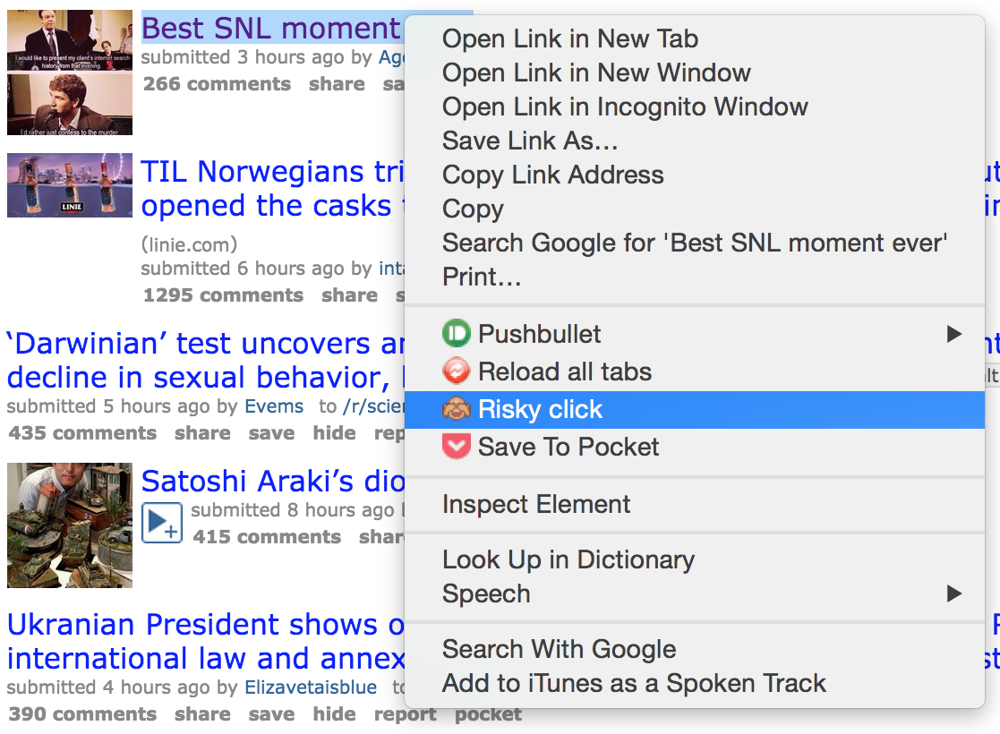

# Risky

Want to see what's behind that link, but scared it's something horrible? Risky's here to help.

## How to use
* Right click on the suspicious link.

* Use the slider to gradually un-blur the page.

* Alternatively, check the 'auto' box to have Risky gradually un-blur the image automatically (10% per second).

---

Risky was made as a very quick hack while I was supposed to be supervising at [ICHack](http://www.ichack.org) 2015.

Icons are courtesy of the [emojidex](https://github.com/emojidex/emojidex-rasters) project.
